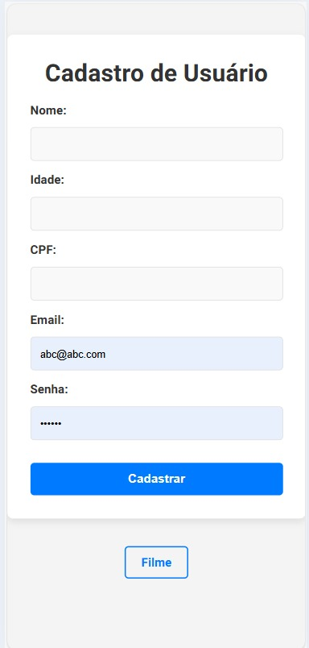
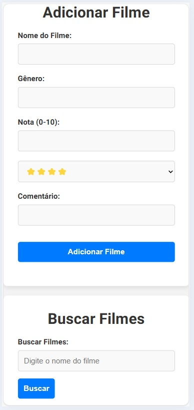
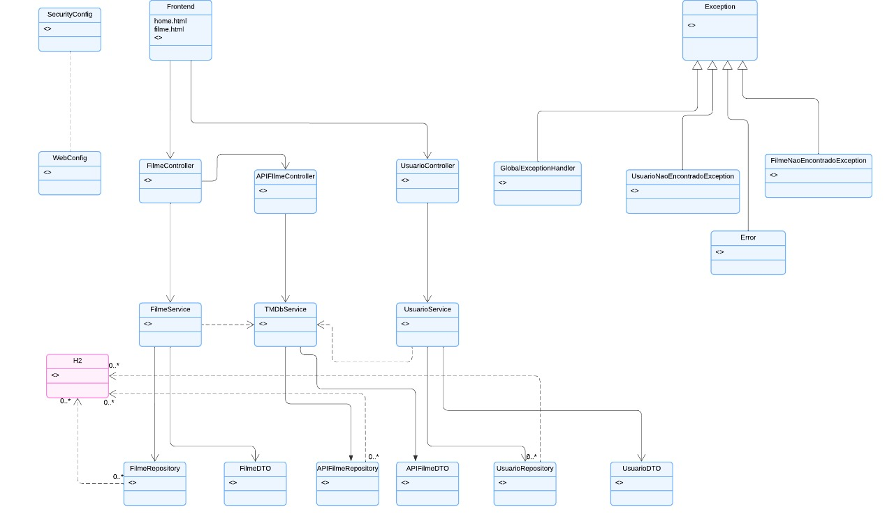

<div align="center">
  
  <h1 style="font-size: 20px;"><b>REST API - JAVA SPRING BOOT </b></h1>
</div>

<h1 align="center">

</h1></h1>

<div align="center">
<b><span style="font-size: 18px;">Módulos 5 e 6: Programação Web II e Testes Automatizados I</span></b><br>Projeto desenvolvido pelo grupo 5 da turma 1173 do programa <b>Santander Coders</b> 2024.1 em parceria com a <b>Ada Tech</b>
</div>

## Descrição do Projeto

O projeto é uma aplicação desenvolvida em Java utilizando o framework Spring Boot. Foi desenvolvida uma API RESTful para
consultar informações sobre filmes, e também inclui funcionalidades de persistência de dados, segurança e consumo da API
externa pública do [The Movie Database (TMDb)](https://www.themoviedb.org/).

Também foi desenvolvida uma implementação inicial de front-end para que usuário possa interagir com a aplicação.

Além disso, também foram desenvolvidos os testes automatizados para garantir a qualidade e a confiabilidade da aplicação. Os testes foram desenvolvidos utilizando o framework JUnit e a biblioteca Mockito para simulação de dependências.

### Principais Funcionalidades

1. **Persistência em Banco de Dados**:
    - Utilização do banco de dados H2 em memória para armazenamento temporário dos dados.

2. **Console H2**:
    - Acesso ao console H2 para visualização e manipulação dos dados armazenados no banco de dados em memória.

3. **Configuração de Segurança**:
    - Implementação de controle de rota e autenticação básica com login e senha.

4. **Consumo de API Externa**:
    - Integração com a API pública do The Movie Database (TMDb) para obter informações sobre filmes.

5. **Front-end**:
    - Implementação inicial de front-end com as seguintes funcionalidades:
        - Cadastro de usuários;
        - Cadastro e classificação de filmes;
        - Busca de filmes cadastrados no banco de dados.

<table align="center" style="width: 80%;">
  <tr>
    <td align="center" style="width: 20%;">
<br />
    <td align="center" style="width: 20%;">
<br />  </tr>
</table>

## Objetivos do Projeto

O projeto atual foi desenvolvido ao longo dos módulos 5 e 6 da formação, sendo os objetivos de cada módulo os seguintes:

### MÓDULO 5 - Construir uma API REST com os seguintes itens:

- Persistência em banco de dados (H2 ou Postgres);
- Configuração de segurança: controle de rota e login (jwt opcional);
- Consumo de uma API externa pública;
- Opcionais: implementação de Swagger e Front-end.

### MÓDULO 6 - Criação dos Testes Automatizados da Aplicação

Tipos de testes implementados incluem:
- **Testes Unitários:** Verificação do comportamento de unidades individuais de código, como serviços e controladores, de forma isolada.
- **Testes de Integração:** Validação da interação entre diferentes componentes da aplicação e a integração com o banco de dados.
- **Testes de Integração com API Externa:** Garantia de que a integração com a API do TMDb funciona corretamente e retorna os dados esperados.

A cobertura mínima exigida dos testes foi de 60% do código da aplicação. E a implementação de testes end-to-end foi opcional.

## Ferramentas e Tecnologias Utilizadas


## Guia de Uso

1. **Clone o repositório para sua máquina local**:
   ```sh
   git clone https://github.com/lauluah/API-filmes.git
   ```

2. **Navegue até o diretório do projeto**:
   ```sh
   cd seu-repositorio
   ```

3. **Execute o comando para iniciar a aplicação**:
   ```sh
   ./mvnw spring-boot:run
   ```

4. **Acesse o console H2 para visualizar o banco de dados**:

   Acesse `http://localhost:8080/h2` em seu navegador. Utilize as seguintes credenciais para login:
    - **JDBC URL**: `jdbc:h2:mem:test`
    - **User Name**: `adatech`
    - **Password**: `54321`

5. **Interaja com a aplicação e com a API REST**

    - Cadastre usuários e filmes no banco de dados e consulte as informações utilizando as rotas disponíveis.
    - Envie requisições à API externa para buscar informações sobre filmes.
    - Utilize uma ferramenta HTTP Client, como [Postman](https://www.postman.com/)
      ou [Insomnia](https://insomnia.rest/).
        - URL base: `http://localhost:8080` (ou de acordo com a porta configurada na máquina).
        - É possível consultar exemplos de requisições logo abaixo.

6. **Execute os testes automatizados**:

    - Repositório com cenários de testes End-to-End usando Cucumber: [Testes E2E](https://github.com/peixotots/API-filmes-testese2e)

### EXEMPLOS DE REQUISIÇÕES

#### a) Criar um Usuário no Banco de Dados

- **Endpoint**: `http://localhost:8080/usuarios`
- **Método**: POST
- **Corpo da Requisição**:
  ```json
  {
    "nome": "Nome do Usuário",
    "idade": "Idade do Usuário",
    "cpf": "CPF do Usuário", //(necessário ser um CPF válido)
    "password": "Senha do Usuário",
    "email": "Email do Usuário"
    }

#### b) Buscar Informações de um Usuário Criado

- **Endpoint**: `/usuarios/{id}`
- **Autorizar com login e senha**: email e senha do usuário criado
- **Método**: GET
- **Exemplo de Requisição**:
  ```sh
  curl -X GET  http://localhost:8080/usuarios/1
  ```
- É possível buscar o usuário pelos seguintes dados: {id}, {nome}, {email} e {cpf} (basta substituir o valor final do
  parâmetro na URL).

#### c) Deletar um Usuário do Banco de Dados

- **Endpoint**: `/usuarios/{id}`
- **Autorizar com login e senha**: email e senha do usuário criado
- **Método**: DELETE
- **Exemplo de Requisição**:
  ```sh
  curl -X DELETE  http://localhost:8080/usuarios/1
  ```

#### d) Criar um Filme no Banco de Dados

- **Endpoint**: `/filmes`
- **Método**: POST
- **Corpo da Requisição**:
  ```json
  {
    "nomeFilme": "Nome do Filme",
    "genero": "Gênero do Filme",
    "nota": "Nota do Filme",
    "comentario": "Comentário do Filme",
    "corAvaliacao": "Cor da Avaliação do Filme"  
  }
  ```

#### e) Buscar Informações de um Filme Criado

- **Endpoint**: `/filmes/nomeFilme?nome={nomeFilme}`
- **Método**: GET
- **Exemplo de Requisição**:
  ```sh
  curl -X GET  http://localhost:8080/filmes/nomeFilme?nome={nomeFilme}
  ```
- É possível buscar o filme criado pelos seguintes dados: {id}, {nome}, {gênero}, {cor da avaliação} e {nota} (basta
  substituir o valor final do parâmetro na URL).

#### f) Buscar Filme pelo Nome na API Externa

- **Endpoint**: `/api/filmes/tmdb/nome/{nomeFilme}`
- **Método**: GET
- **Exemplo de Requisição**:
  ```sh
  curl -X GET  http://localhost:8080/api/filmes/tmdb/nome/Matrix
  ```
- Será retornado um JSON com as seguinte informações sobre o filme buscado: título, sinopse, data de lançamento, tempo
  de duração, gênero, popularidade e idioma original.

#### g) Popular o Banco de Dados com Filmes da API Externa

- **Endpoint**: `/api/filmes/tmdb/nome/{nomeFilme}`
- **Método**: POST
- **Exemplo de Requisição**:
  ```sh
  curl -X POST  http://localhost:8080/api/filmes/tmdb/nome/Inception
  ```
## Diagrama de Classes
<br />

## Entregas do Projeto

- [x] Código fonte: API REST em Java com Spring Boot com persistência de dados, configuração de segurança com login e
  senha e consumo de API externa
- [x] Documentação com descrição do projeto e guia de uso
- [x] Apresentação do código, da documentação e da aplicação em funcionamento
- [x] Implementação inicial do Front-end
- [x] Diagrama de classes
- [x] Testes automatizados: testes unitários, de integração e cenários de testes End-to-End usando Cucumber

## O Que Não Foi Entregue

- [ ] Implementação de Swagger
- [ ] Autenticação JWT

## Principais Desafios Encontrados

- **Persistência de Dados**: Configurar o banco de dados H2 e realizar operações CRUD.
- **Integração com API Externa**: Aprender a consumir uma API externa e tratar os dados recebidos.
- **Configuração de Segurança**: Implementar controle de rota e autenticação básica.
- **Front-end**: Desenvolver a interface do usuário para interagir com a aplicação e implementar a comunicação com o
  back-end.
- **Testes Automatizados**: Entender como testar a lógica da aplicação (e não código) e pensar em cenários de teste.

## Integrantes

<table align="center" style="width: 80%;">
  <tr>
    <td align="center" style="width: 20%;">
      <br />
      <sub><b>Ana Laura Marques Rodrigues</b></sub><br />
      <a href="https://github.com/lauluah" target="_blank">GitHub</a>
    </td>
    <td align="center" style="width: 20%;">
      <br />
      <sub><b>Arthur Gabriel De Menezes Viana</b></sub><br />
      <a href="https://github.com/arthurgmv" target="_blank">GitHub</a>
    </td>
    <td align="center" style="width: 20%;">
      <br />
      <sub><b>Tainá Souza Peixoto</b></sub><br />
      <a href="https://github.com/peixotots" target="_blank">GitHub</a>
    </td>
  </tr>
</table>

